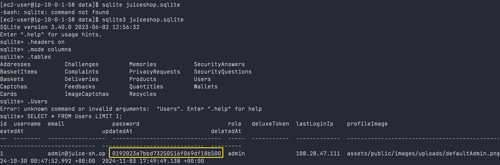
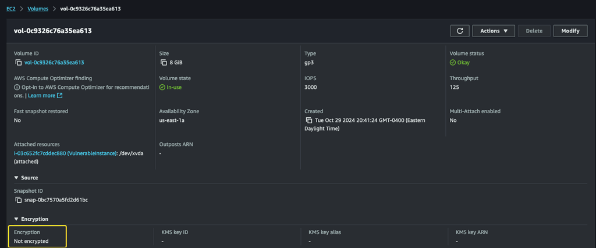

# Vulnerability Assessment

This assessment identified security weaknesses across the application, storage, network configuration, and AWS environment. The findings below summarize the issues identified during the review and the recommended remediation.

---

## Vulnerable Application Dependencies

  

*AWS Inspector identifying package vulnerabilities.*

**Finding**

AWS Inspector identified **108 package vulnerabilities** affecting application dependencies, including multiple publicly disclosed CVEs.

**Recommendation**

Update vulnerable packages, remove unsupported dependencies, and establish a regular dependency review process.

---

## Insecure Credential Storage

  

*User records stored within the application database.*

**Finding**

User records, including password hashes, were stored within the application database. The assessment also identified the use of **MD5** for password storage.

**Recommendation**

Replace MD5 with a stronger password hashing algorithm such as bcrypt, restrict database access, and protect sensitive credentials.

---

## Unencrypted EBS Volume

  

*EBS volume attached to the EC2 instance with encryption disabled.*

**Finding**

The EC2 instance used an unencrypted EBS volume, leaving data at rest without native AWS encryption.

**Recommendation**

Enable EBS encryption with AWS KMS and implement automated snapshots to improve data protection and recovery.

---

## Overly Permissive Network Access

**Finding**

Network access controls permitted broader connectivity than required, increasing the exposed attack surface.

**Recommendation**

Review Security Groups and Network ACLs, remove unnecessary inbound access, and enforce least-privilege network policies.

---

## Missing AWS Security Controls

**Finding**

The assessment identified opportunities to strengthen identity management, logging, monitoring, and account-level security controls across the AWS environment.

**Recommendation**

Implement least-privilege IAM policies and enable CloudTrail, CloudWatch, GuardDuty, and Security Hub to improve visibility and security monitoring.

