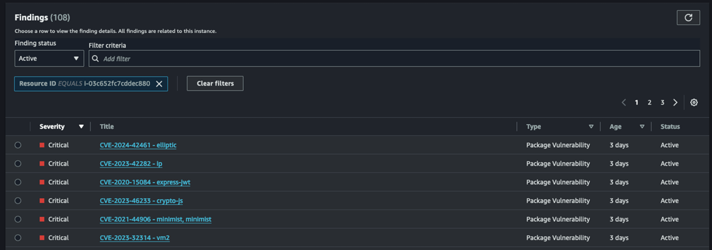
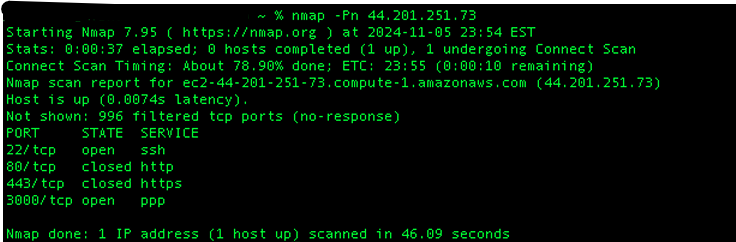
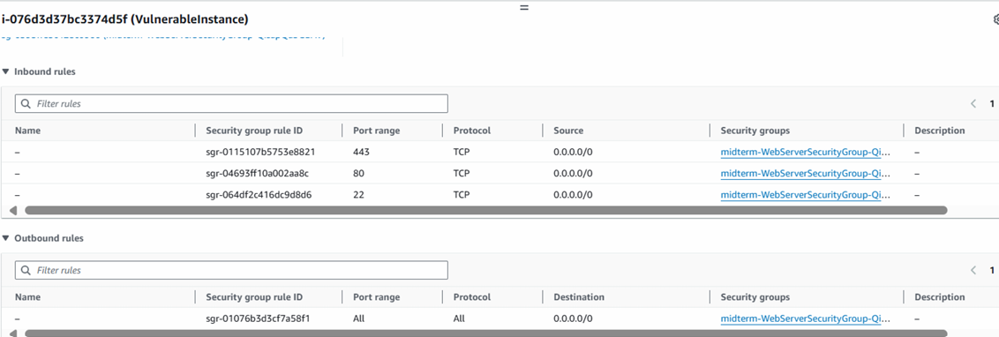
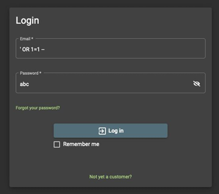
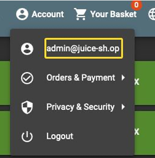
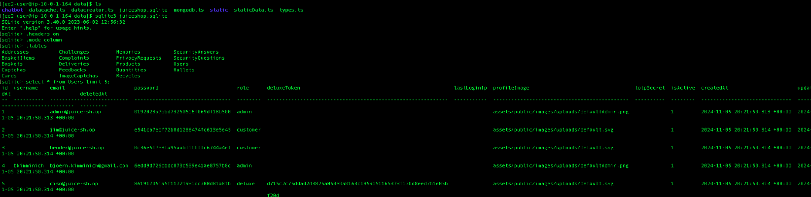
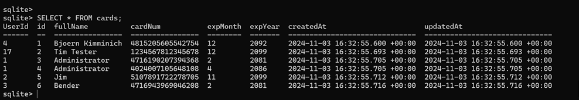
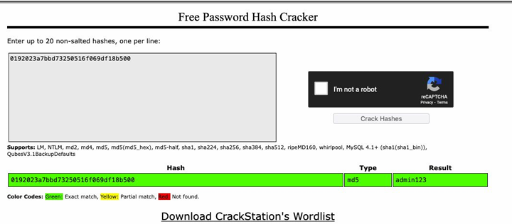
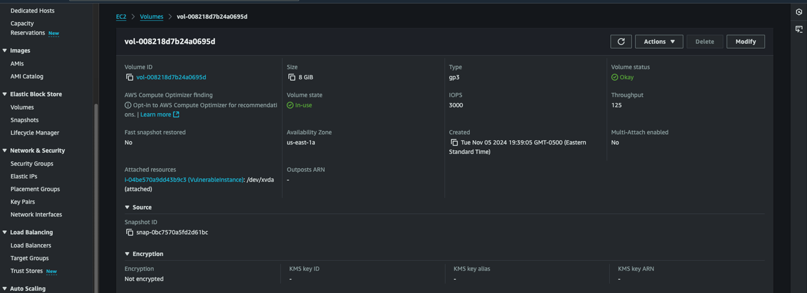

# Cloud Security Assessment

## Overview

This assessment examines the security of an AWS-hosted **OWASP Juice Shop** environment from both a cloud infrastructure and application security perspective. Using a combination of automated analysis and hands-on validation, I identified vulnerabilities across the application, network, authentication, and data layers, then verified their impact through practical testing.

Rather than relying solely on automated scans, each finding was validated to understand its real-world impact and prioritize practical remediation. The assessment aligns with the **OWASP Top 10** and **CIS AWS Foundations Benchmark**, providing recommendations to strengthen the overall security posture of the environment.

---

## Scope

### Cloud Infrastructure

- Amazon EC2
- AWS Security Groups
- Amazon EBS

### Application

- OWASP Juice Shop
- SQLite Database
- Node.js Dependencies

### Assessment Activities

- Vulnerability Analysis
- Manual Exploitation
- Network Enumeration
- Infrastructure Configuration Review

---

## Methodology

The assessment combined automated vulnerability analysis with manual validation to verify exploitable weaknesses and eliminate false positives. Each finding was evaluated based on its technical impact, supporting evidence, and alignment with industry security best practices.

### Validation Techniques

- AWS Inspector
- SQL Injection Testing
- SQLite Database Analysis
- Password Hash Analysis
- Nmap Reconnaissance
- AWS Security Group Review
- Amazon EBS Configuration Review

---

## Frameworks

- **OWASP Top 10** – Application Security
- **CIS AWS Foundations Benchmark** – Cloud Security Configuration
- **AWS Security Best Practices** – Infrastructure Hardening

---

# Findings

The assessment identified security weaknesses across the application's software dependencies, cloud infrastructure, authentication mechanisms, and data protection controls. Each finding below includes supporting evidence, an impact assessment, and recommended remediation.

---

# Initial Attack Surface

## 1. Vulnerable Application Dependencies

### Overview

AWS Inspector identified **108 vulnerable software packages**, including multiple **Critical** and **High** severity CVEs affecting outdated Node.js dependencies such as `elliptic`, `express-jwt`, `crypto-js`, `minimist`, and `vm2`. These components contained publicly disclosed vulnerabilities that remained unpatched, increasing the application's exposure to known attacks.

### Impact

Outdated third-party libraries are a common target because publicly available exploits often exist shortly after vulnerabilities are disclosed. Depending on the affected package, successful exploitation could result in authentication bypass, denial-of-service, prototype pollution, or even remote code execution.

### Evidence

**Figure 1.** AWS Inspector identifying vulnerable application dependencies.

### Recommendation

- Update vulnerable packages to supported versions.
- Remove deprecated or unused dependencies.
- Integrate automated dependency scanning into the CI/CD pipeline using AWS Inspector and `npm audit`.
- Establish a regular patch management process to reduce exposure to newly disclosed vulnerabilities.

### Framework Alignment

| Standard | Mapping |
|----------|---------|
| **OWASP Top 10** | **A06 – Vulnerable and Outdated Components** |
| **CIS AWS Foundations Benchmark** | Continuous Vulnerability Management |

---

## 2. Publicly Exposed Infrastructure

### Overview

Network reconnaissance identified multiple publicly accessible services, including **SSH (Port 22)** and the OWASP Juice Shop application running on **Port 3000**. Review of the associated AWS Security Group confirmed unrestricted inbound access from **0.0.0.0/0**, unnecessarily increasing the environment's external attack surface.

### Impact

Exposed management and application services increase the likelihood of reconnaissance, brute-force attempts, and exploitation of application vulnerabilities. Broad Security Group rules also make it easier for attackers to discover and interact with publicly accessible resources.

### Evidence

**Figure 2.** Nmap scan identifying publicly accessible services.

**Figure 3.** AWS Security Group permitting unrestricted inbound access.

### Recommendation

- Restrict Security Group rules to trusted IP ranges.
- Remove unnecessary public-facing services.
- Replace publicly accessible SSH with AWS Systems Manager Session Manager where appropriate.
- Apply the principle of least privilege to inbound Security Group rules.

### Framework Alignment

| Standard | Mapping |
|----------|---------|
| **OWASP Top 10** | Infrastructure Finding |
| **CIS AWS Foundations Benchmark** | Network Security & Security Group Configuration |

---

# Exploitation

## 3. SQL Injection Vulnerability

### Overview

Manual testing confirmed that the application was vulnerable to **SQL injection**, allowing authentication controls to be bypassed and administrative access to be obtained without valid credentials. Successful exploitation demonstrated that user-supplied input was not properly validated before being processed by the backend database.

### Impact

Authentication bypass allows an attacker to gain unauthorized administrative access without valid credentials. Once authenticated, the attacker can access restricted functionality, retrieve sensitive information, and use the compromised application as a starting point for further attacks.

### Evidence

**Figure 4.** Authentication bypass using SQL injection.

**Figure 5.** Administrative dashboard accessed following successful exploitation.

### Recommendation

- Use parameterized queries or prepared statements for all database interactions.
- Implement server-side input validation and output encoding.
- Avoid dynamically constructing SQL queries using user input.
- Perform regular application security testing against the OWASP Top 10.

### Framework Alignment

| Standard | Mapping |
|----------|---------|
| **OWASP Top 10** | **A03 – Injection** |
| **CIS AWS Foundations Benchmark** | Application Security Best Practices |

---

## 4. Unauthorized Access to Sensitive Data

### Overview

Following successful authentication bypass, the assessment confirmed that sensitive information stored within the application's SQLite database could be directly accessed. User account records, email addresses, password hashes, and payment card information were exposed without additional access controls, demonstrating the impact of the compromised application.

### Impact

Exposure of sensitive application data increases the risk of account compromise, identity theft, financial fraud, and credential reuse attacks. If this environment contained production data, the compromise would also introduce significant privacy and regulatory concerns.

### Evidence

**Figure 6.** User account records retrieved from the SQLite database.

**Figure 7.** Payment card information retrieved during database inspection.

### Recommendation

- Restrict direct database access to authorized services only.
- Encrypt sensitive data at rest where appropriate.
- Minimize retention of unnecessary sensitive information.
- Implement role-based access controls following the principle of least privilege.

### Framework Alignment

| Standard | Mapping |
|----------|---------|
| **OWASP Top 10** | **A01 – Broken Access Control** **A02 – Cryptographic Failures** |
| **CIS AWS Foundations Benchmark** | Data Protection & Access Control |

---

## 5. Weak Password Hashing

### Overview

Inspection of the application's user database revealed that passwords were stored using the **MD5 hashing algorithm**. Validation confirmed that multiple password hashes could be successfully recovered using publicly available hash-cracking resources, demonstrating that the stored credentials provided limited resistance against offline attacks.

### Impact

Weak password hashing significantly reduces the effort required to recover user credentials once password hashes are exposed. Recovered passwords may enable account compromise, credential reuse attacks against other services, and unauthorized access to additional systems where users have reused the same credentials.

### Evidence

**Figure 8.** MD5 password hashes successfully recovered during validation.

### Recommendation

- Replace MD5 with a modern password hashing algorithm such as **bcrypt**, **Argon2**, or **PBKDF2**.
- Enforce strong password policies for all user accounts.
- Enable multi-factor authentication for privileged users.
- Monitor for compromised credentials and require password resets when weak hashes are exposed.

### Framework Alignment

| Standard | Mapping |
|----------|---------|
| **OWASP Top 10** | **A07 – Identification and Authentication Failures** |
| **CIS AWS Foundations Benchmark** | Identity & Authentication Best Practices |

---

# Defensive Controls

## 6. Unencrypted Storage

### Overview

Review of the EC2 storage configuration confirmed that the attached Amazon EBS volume was **not encrypted**. While the application remained operational, the absence of encryption at rest increased the risk of unauthorized access to sensitive information if the underlying storage volume were compromised or improperly accessed.

### Impact

Without encryption at rest, sensitive application data relies solely on access controls for protection. Enabling encryption provides an additional layer of defense against unauthorized access, snapshot exposure, or storage misconfiguration.

### Evidence

**Figure 9.** Amazon EBS volume configured without encryption.

### Recommendation

- Enable Amazon EBS encryption using AWS KMS-managed keys.
- Encrypt snapshots containing sensitive application data.
- Enable encryption by default for future EBS volumes.
- Regularly review storage configurations to ensure encryption policies remain enforced.

### Framework Alignment

| Standard | Mapping |
|----------|---------|
| **OWASP Top 10** | **A02 – Cryptographic Failures** |
| **CIS AWS Foundations Benchmark** | Storage Protection & Encryption |

# Next Steps

The findings in this assessment represent the most significant security risks identified during testing. Beyond these validated issues, the following improvements would further strengthen the security posture of the environment and support long-term operational resilience.

### Identity & Access Management

- Apply the principle of least privilege to IAM users and roles.
- Enable Multi-Factor Authentication (MFA) for privileged accounts.
- Replace long-lived administrative credentials with temporary IAM roles where possible.

### Monitoring & Threat Detection

- Enable AWS CloudTrail to capture account activity across the environment.
- Configure Amazon GuardDuty to continuously monitor for suspicious behavior.
- Enable VPC Flow Logs and centralize security logs using Amazon CloudWatch to improve visibility and incident response.

### Infrastructure Security

- Restrict Security Group rules to trusted administrative networks.
- Enable encryption by default for all new Amazon EBS volumes and snapshots.
- Perform routine vulnerability scanning and dependency updates using AWS Inspector.

### Secure Development

- Validate user input using parameterized queries and server-side input validation.
- Integrate automated dependency scanning into the CI/CD pipeline.
- Perform periodic penetration testing and security reviews to identify newly introduced vulnerabilities.

---

# Conclusion

This assessment demonstrates how security weaknesses across cloud infrastructure, application security, authentication, and data protection can be identified, validated, and prioritized using a structured approach. The validated findings provide clear remediation opportunities while highlighting the importance of secure configuration, continuous monitoring, and proactive vulnerability management.
