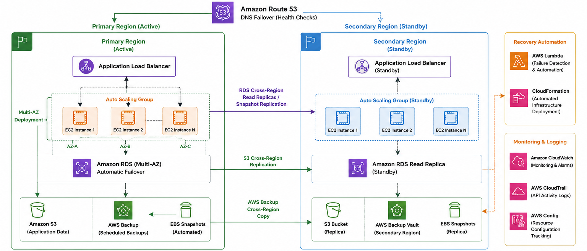

# Disaster Recovery Strategy

> Designing a resilient AWS architecture to improve availability, reduce downtime, and support rapid recovery following infrastructure failures.

---

## Overview

Following the cloud security assessment, I designed a disaster recovery strategy to improve the resilience of the AWS-hosted OWASP Juice Shop environment. Rather than focusing on additional vulnerabilities, this strategy demonstrates how the environment can recover quickly from infrastructure failures while minimizing downtime and data loss.

The proposed solution combines Multi-AZ deployments, automated backups, Route 53 failover, cross-region replication, and recovery automation using AWS-native services to support recovery objectives of **less than 15 minutes RTO** and **less than 5 minutes RPO**.

---

## Recovery Objectives

| Objective | Target |
|-----------|--------|
| **Recovery Time Objective (RTO)** | **< 15 minutes** |
| **Recovery Point Objective (RPO)** | **< 5 minutes** |
| **Availability** | Multi-AZ deployment |
| **Backup Strategy** | Automated AWS Backup |
| **Regional Recovery** | Cross-Region Replication |

---

# Proposed Architecture

The proposed architecture follows a **warm standby, multi-region recovery model**. The production workload runs in the primary AWS Region while a fully configured standby environment is maintained in a secondary Region. Critical application data is continuously replicated, allowing services to recover quickly during infrastructure or regional failures.

---

# Key Design Improvements

## 1. Multi-AZ High Availability

### Why it was introduced

The original deployment relied on a single Availability Zone, creating a potential single point of failure. The redesigned architecture distributes application resources across multiple Availability Zones behind an Application Load Balancer.

### How it improves recovery

If one Availability Zone becomes unavailable, traffic is automatically routed to healthy instances while Amazon RDS Multi-AZ provides seamless database failover with minimal disruption.

---

## 2. Automated Backup Strategy

### Why it was introduced

Reliable backups are essential for recovering from accidental deletion, corruption, or infrastructure failures. The strategy introduces automated backups to reduce manual recovery effort.

### How it improves recovery

AWS Backup schedules recurring backups of critical resources, while automated EBS snapshots protect application volumes. Cross-region backup copies provide an additional recovery layer if the primary region becomes unavailable.

---

## 3. Cross-Region Disaster Recovery

### Why it was introduced

Although Multi-AZ deployments protect against Availability Zone failures, they cannot recover from a complete regional outage.

### How it improves recovery

Critical resources—including Amazon RDS, Amazon S3, AWS Backup vaults, and EBS snapshots—are replicated to a secondary AWS Region. Maintaining a warm standby environment significantly reduces recovery time during large-scale outages.

---

## 4. Route 53 DNS Failover

### Why it was introduced

Even with a standby environment, users must be redirected to the healthy region during an outage. Without automated DNS failover, recovery would depend on manual intervention, increasing downtime.

### How it improves recovery

Amazon Route 53 continuously monitors the health of the primary environment. If a failure is detected, traffic is automatically redirected to the standby region, allowing users to reconnect with minimal disruption.

---

## 5. Recovery Automation

### Why it was introduced

Manual recovery increases downtime and introduces the risk of configuration errors during high-pressure incidents.

### How it improves recovery

AWS Lambda and CloudFormation automate infrastructure deployment and recovery tasks, allowing services to be restored consistently while reducing manual intervention.

---

## 6. Monitoring & Recovery Validation

### Why it was introduced

A disaster recovery strategy is only effective if recovery procedures are continuously monitored and regularly tested.

### How it improves recovery

Amazon CloudWatch monitors infrastructure health, AWS CloudTrail records recovery activity, and AWS Config tracks configuration changes. Together, these services provide visibility throughout the recovery process and help validate that recovery objectives continue to be met.

---

# Recovery Workflow

1. Route 53 detects a failure in the primary region through health checks.
2. Traffic is automatically redirected to the standby environment.
3. Amazon RDS replicas are promoted to become the primary database.
4. Auto Scaling provisions additional EC2 instances if demand increases.
5. Replicated data stored in Amazon S3 and AWS Backup supports application recovery.
6. CloudWatch, CloudTrail, and AWS Config monitor the recovery process until normal operations resume.

---

## Conclusion

This disaster recovery strategy transforms the environment from a single-region deployment into a resilient multi-region architecture capable of recovering from infrastructure failures with minimal downtime. By combining high availability, automated backups, Route 53 failover, cross-region replication, and recovery automation, the proposed design strengthens business continuity while aligning with AWS disaster recovery best practices.
